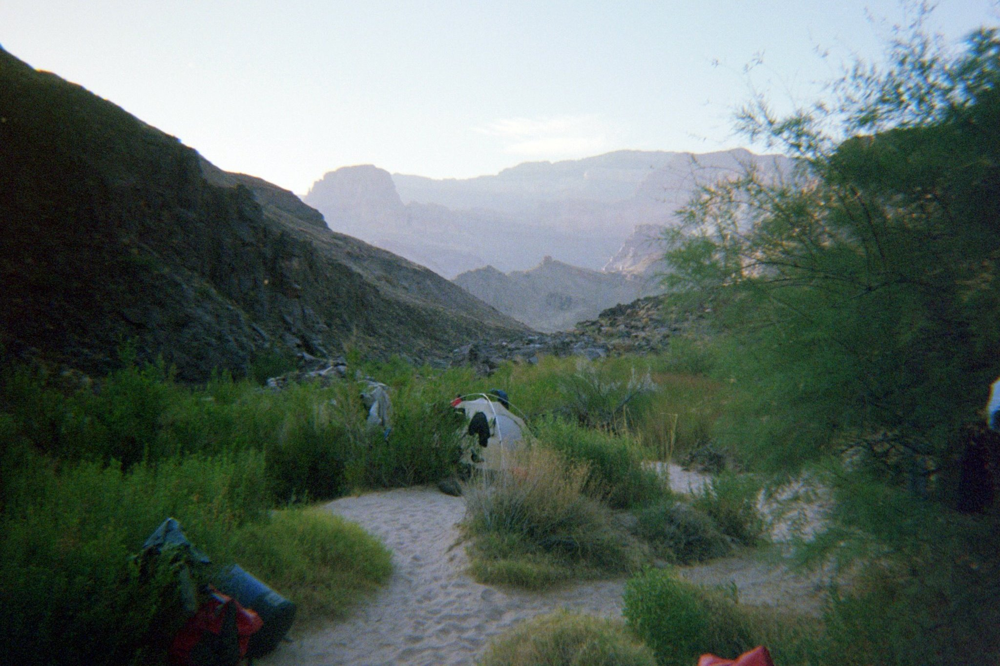
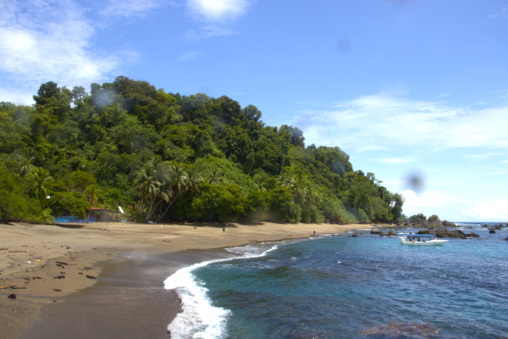
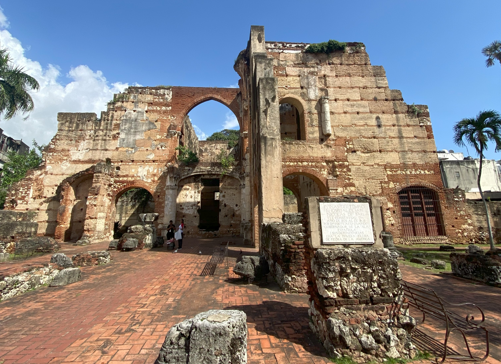

# My travel adventures are linked below in the different cards. I've treated these somewhat like a travel blog. Some are for research purposes, and some are just for fun. I hope you enjoy them!


```{=html}
<div class="trip-container">

  <div class="trip-card">
    <a href="GCE.qmd">
      
      <div class="overlay"></div>
      <h2>Grand Canyon Expedition June 2024</h2>
    </a>
  </div>

  <div class="trip-card">
    <a href="aus.qmd">
      
      <div class="overlay"></div>
      <h2>NSF IRES Program: Australia Coral Reef Science</h2>
    </a>
  </div>

  <div class="trip-card">
    <a href="costa_rica.qmd">
      
      <div class="overlay"></div>
      <h2>Costa Rica 2023</h2>
    </a>
  </div>

  <div class="trip-card">
    <a href="DR.qmd">
      
      <div class="overlay"></div>
      <h2>The Dominican Republic Chronicles</h2>
    </a>
  </div>

</div>
```

